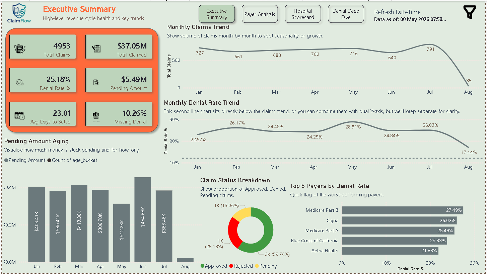
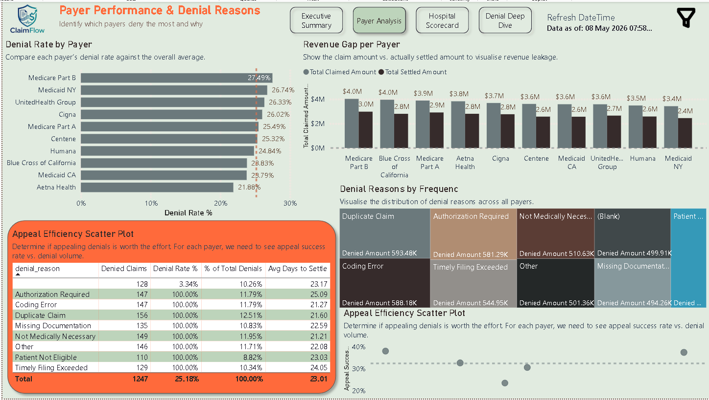
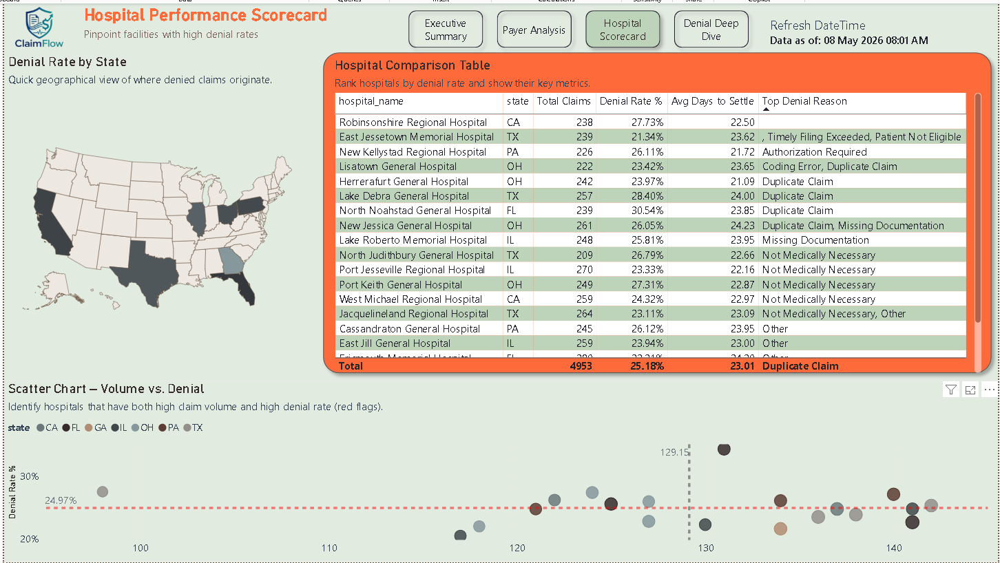
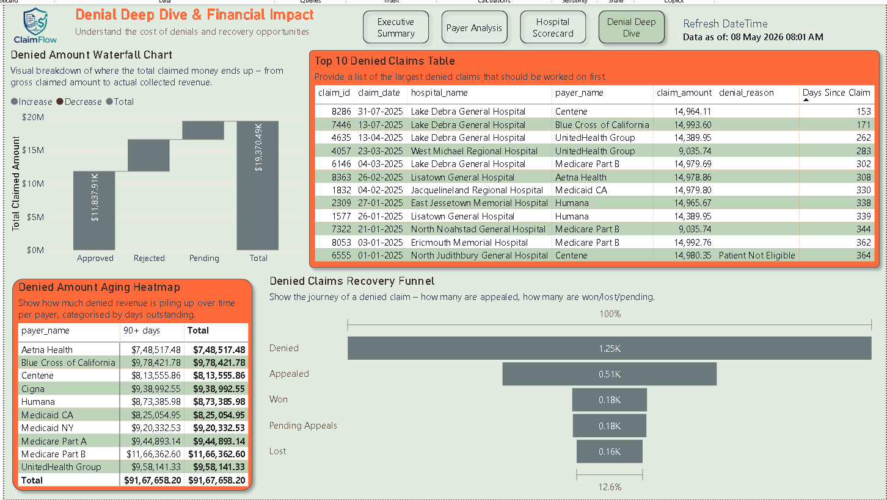
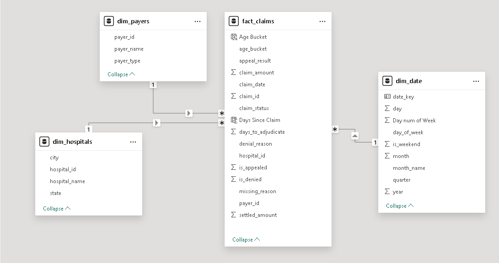

# 🏥 ClaimFlow Analytics – Healthcare Revenue Cycle Dashboard
### End-to-End Business Intelligence Case Study for SettleMed

---

## Executive Summary

**ClaimFlow Analytics** is a comprehensive Power BI dashboard built to tackle the **$ multi‑billion claim denial problem** in US healthcare.  
The project was designed for **SettleMed**, a Noida‑based healthcare billing startup, to deliver a single source of truth for monitoring, investigating, and recovering denied insurance claims.

Using synthetically generated but realistic claims data, this solution simulates a full revenue cycle analytics workflow — from raw data ingestion to actionable financial insights.

> **Time Period:** Jan 2024 – Dec 2025 | **Claims:** ~50,000 | **Hospitals:** 25+ | **Payers:** 12

---

## ❗ The Problem

- US hospitals lose **billions yearly** due to claim denials and underpayments  
- Billing teams lack **real‑time visibility** into which payers deny, why, and how much cash is stuck  
- SettleMed needed a **centralized analytics system** to:
  - Track denial patterns
  - Prioritize recovery efforts
  - Measure financial impact  
  - Improve revenue cycle efficiency

---

## ❓ Business Questions Answered

1. Which payers deny the most claims and why?  
2. How much money is stuck in pending claims and for how long?  
3. Which hospitals have the worst denial rates?  
4. What is the financial impact of denials and are appeals worth the effort?

---

## 🧩 Solution Architecture

The pipeline follows a **modular analytics architecture**:
- **Raw Data:** Simulated healthcare claims (Python)  
- **ETL:** Power Query (6 cleaning steps)  
- **Data Model:** Star Schema (4 tables)  
- **Calculations:** 20+ DAX measures  
- **Visualization:** Multi‑page Power BI dashboard  
- **Deployment:** Portfolio website (coming soon)

---

## 📊 Dashboard Walkthrough

The dashboard consists of **4 interactive pages**, each targeting a specific stakeholder need.

### 📄 Page 1 – Executive Summary
*High‑level KPIs, monthly trends, claim status distribution, top payers, pending aging*

### 📄 Page 2 – Payer Analysis
*Denial rate by payer, revenue gap, denial reasons treemap, appeal success scatter plot*

### 📄 Page 3 – Hospital Scorecard
*Geographic map, hospital comparison table, volume vs denial rate chart*

### 📄 Page 4 – Denial Deep Dive & Financial Impact
*Waterfall chart (revenue impact), recovery funnel, aging heatmap, top 10 denied claims*

---

## ⭐ Data Model (Star Schema)

A clean star schema was designed for fast analytics:

- **Fact Table:** `fact_claims` (claim‑level transactions)  
- **Dimension Tables:** `dim_hospitals`, `dim_payers`, `dim_date`  
- **Relationships:** 1‑to‑many from dimensions to fact  
- **DAX Date Table:** Custom date dimension for time intelligence

---

## ⚙️ Technical Highlights

- **Star Schema** with 4 tables – optimized for performance  
- **20+ DAX measures** – Denial Rate, Recovery %, MoM Growth, Appeal Success Rate, Data Quality KPI  
- **Power Query automation** – 6 cleaning steps:
  - Removing duplicates
  - Standardizing mixed casing (payer names, denial reasons)
  - Handling missing denial reasons
  - Filtering invalid dates
  - Creating derived columns
- **Real‑world messiness** directly replicated from raw healthcare export files

---

## 💡 Key Insights & Recommendations

| Insight | Recommendation |
|--------|----------------|
| **Commercial payers** deny 15‑18% of claims; top reason: “Missing Documentation” | Create pre‑submission checklists for high‑denial payers |
| **~$450K** stuck in pending claims, 20% older than 90 days | Implement automated aging alerts for follow‑up |
| Appeals recover **50%** of denied dollars, but only **40%** of denials are appealed | Develop standard appeal templates and train billing staff |
| Two hospitals flagged with **>25% denial rate** | Recommend targeted coding audits and process reviews |

---

## 🛠️ Tools & Technologies

| Category | Tools / Techniques |
|----------|-------------------|
| Data Generation | Python (Pandas, NumPy, Faker) |
| Data Transformation | Power Query (Power BI) |
| Data Modeling | Star Schema, DAX |
| Dashboard | Power BI Desktop |
| Presentation | Microsoft PowerPoint |
| Version Control | Git & GitHub |
| Deployment | Portfolio website (upcoming) |

---

## 📁 Project Deliverables

- [ ] Power BI Dashboard (.pbix) – **Demo available on request**  
- [x] Project Presentation (.pdf) – [View PDF](./SettleMed-ClaimFlow_presentation.pdf)  
- [x] Sample Dataset (CSV) – `sample_data.csv`  
- [x] Star Schema Diagram – `star_schema.png`  
- [x] Full README documentation  

---

## 🌐 Portfolio & Contact

**Pushpal Kawara**  
Data Analyst | Power BI | Excel | SQL | Python | Healthcare Analytics  

✉️ **Email:** [kawarapushpaldilip@gmail.com](mailto:kawarapushpaldilip@gmail.com)  
🔗 **LinkedIn:** [linkedin.com/in/kawara-pushpal-dilip-12b5a2410](https://www.linkedin.com/in/kawara-pushpal-dilip-12b5a2410)  
📂 **Portfolio:** *Under development — will be updated soon*  

> 💼 *Open to opportunities in BI, Product Analytics & Healthcare Revenue Cycle*

---

> ⚠️ *Disclaimer: This is a portfolio project. Not affiliated with SettleMed or any real healthcare entity. Data is synthetically generated for demonstration.*